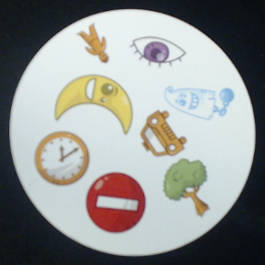
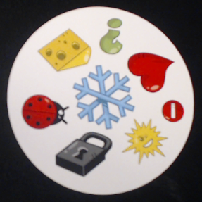

# Introduction

Dobble is a game with the aim to recognise matching symbols in a pair of disc-shaped cards. In this repository we aim to train an image classifier that can identify the common symbol in a pair of cards.

Inspiration from https://www.hackster.io/aidventure/the-dobble-challenge-93d57c

# Conda Environment

The aarch64 version of conda can be got from [https://github.com/Archiconda/build-tools/releases](https://github.com/Archiconda/build-tools/releases)

Conda environment then can be set up 

```
conda env create -f environment-jetson.yml
conda activate dobble
```

# Object detection

## Image preparation and labeling
Images need to be converted from TIF to JPEG for labeling (ImageMagick's `convert` tool is required)
```
./convert-images.sh
```

The resulting images are saved at `data/dobble/images/deck*_card*.jpg`. They now can be imported to LabelBox. 

After the labeling is done in LabelBox, export the results to `data/dobble/labelbox_export.json`

## Dataset preparation
In dobble-jetson-nano directory

Required: 
* `data/dobble/labelbox_export.json` -- a labeled set from Labelbox
* `data/dobble/images/*.jpg` -- images used for labeling

```
python3 labelbox_to_voc.py
```

Saves VOC format dataset to `data/dobble/voc`.

## Training
```
docker/run.sh
# Starts Docker container with shell
./train_object_detection.sh
```

## Inference
```
docker/run.sh
# Starts Docker container with shell
python detect-dobble.py $SOURCE
```
$SOURCE can be an image, a video, or a video device.

# Training

As an example, consider the following two images:




We'll first download a [dataset from Kaggle](https://www.kaggle.com/grouby/dobble-card-images). This dataset contains images of each Dobble card individually.

To turn this into a training set, we must generate pairings of cards and label them according to the common symbol. So for the above two images, we'll create a new image that includes both of those plus a label: _"stop sign"_.

## Setup

```sh
conda create -n dobble-jetson-nano python=3.8.5
conda activate dobble-jetson-nano
```

## Download dataset

Pre-requisites: a Kaggle account is required to use the `kaggle` command line tool. Follow the instructions [here](https://www.kaggle.com/docs/api) to acquire a Kaggle API token and save this locally.

Alternatively, you can download the data directly from the Kaggle website and unzip it to the `data` directory.

```sh
kaggle datasets download -d grouby/dobble-card-images -p data
cd data
unzip dobble-card-images.zip
```

## Generate training data

```sh
python generate-training-set.py
```

# Notes on the Kaggle dataset

Things to bare in mind

* Text files are DOS-formatted, so have Windows/DOS style line endings.
* `dobble_card_symbol_mappings.txt` and `dobble_symbols.txt` begin with a byte-order mark `\ufeff`.
